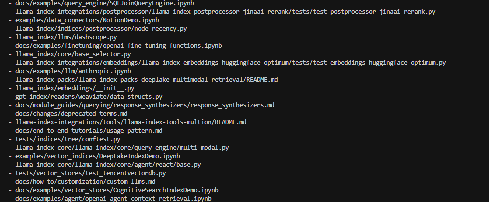

# Sprint 3 Summary: ML-Based Defect Predictor

## Accomplishments in Sprint 3

1. **Implemented Parallel Processing**:
   - Redesigned the feature extraction pipeline to use multiprocessing for analyzing thousands of commits
   - Significantly improved performance by processing commit batches in parallel
   - Enhanced logging to track batch processing progress

2. **Improved Ground Truth Data**:
   - Expanded ground truth dataset to over 20 files for better model evaluation
   - Added more diverse file types to improve training representation
   - Enhanced model's capability to identify potential defects across a larger codebase

3. **Enhanced Output Management**:
   - Implemented dual output system that displays concise information on console while saving detailed analysis to files
   - Added intelligent truncation for large file lists to improve readability
   - Implemented timestamped output files for better tracking of analysis runs

4. **Output Visualization Improvements**:
   - Streamlined console display to show the most important metrics and results
   - Created a foundation for future visual representations of defect predictions

*Sample of the large number of files predicted as buggy, demonstrating the need for further model refinement*

## Current Challenges

1. **Model Precision**:
   - Current precision is lower than desired, with many false positives
   - Model tends to predict too many files as potentially buggy
   - Even with increased ground truth, the repository size necessitates further ground truth expansion

2. **Output Management in Docker Containers**:
   - Output files are currently saved within Docker containers, making access challenging
   - Need to implement volume mounting for better file access

3. **Large Repository Analysis**:
   - Processing large repositories remains resource-intensive despite parallel processing
   - Current approach limited to analyzing repositories within specific time spans

## Plans for Next Sprint

1. **Multi-Repository Analysis**:
   - Extend the model to analyze multiple repositories simultaneously
   - Remove time-based constraints to get insights across different codebases
   - Develop a more generalized model that works on diverse repository structures

2. **Visualization Enhancements**:
   - Implement interactive visualizations for defect predictions
   - Create dashboards to better interpret model outputs and metrics
   - Develop comparative views to highlight most critical areas for attention

3. **Improved Model Training**:
   - Fine-tune model parameters to reduce false positives
   - Implement feature selection to focus on the most predictive metrics
   - Explore alternative ML approaches beyond Random Forest

4. **Move Beyond Ground Truth**:
   - Begin transitioning to a model that doesn't rely heavily on ground truth data
   - Implement unsupervised learning components to identify patterns without labels
   - Develop confidence metrics that don't depend on predefined defect lists

## Technical Improvements Planned

1. **Docker Configuration Enhancements**:
   - Modify Dockerfile to mount volumes for persistent output storage
   - Improve container resource allocation for faster processing
   - Implement better checkpoint saving for long-running analyses

2. **Feature Extraction Refinement**:
   - Add more sophisticated code complexity metrics beyond simple line counts
   - Implement natural language processing for commit message analysis
   - Add semantic code analysis to better understand code structure

3. **Scalability Improvements**:
   - Implement distributed processing for extremely large repositories
   - Develop incremental analysis capabilities to avoid reprocessing entire repositories
   - Create preprocessing pipelines to reduce memory requirements

## Conclusion

Sprint 3 has laid a solid foundation for a more robust and efficient defect prediction system. While we've made significant progress in processing capabilities and output management, we recognize the need for further refinement in model accuracy and repository scalability. Our enhanced ground truth data provides a better baseline, but the sheer scale of modern repositories demands continued improvement in our approach.

By moving toward multi-repository analysis and eventually reducing dependency on ground truth data, we're positioning the system to provide more valuable insights with less manual preparation. The future development will focus on making the tool more practical for real-world development teams while applying the software engineering principles covered in class. 